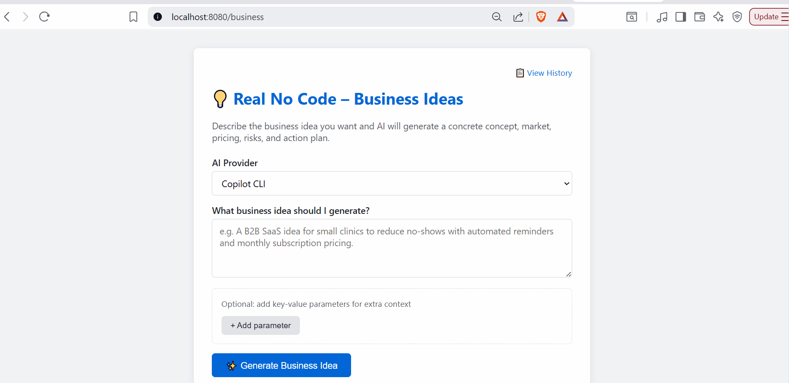

# 💠 Real No Code



> **The UI is the Runtime.** An architecture where the backend doesn't exist and the interface is a hallucination.

---

## 🚀 The Vision

Most "No-Code" tools are just visual programming with more friction — you're still building deterministic logic.

**Real No Code** is a subversive Proof of Concept that treats the LLM as a *just-in-time* rendering engine. Instead of a fixed UI, the application "hallucinates" the necessary interface, logic, and styling in real-time based on user intent. This moves software from **Static Pixels** to **Fluid Probability**.

---

## 🏗 How It Works

1. **Intent Capture** — The user provides a prompt (e.g., *"A CRM for a pet shop"*).
2. **JIT Generation** — The orchestrator sends the intent to a provider (Gemini, Copilot, or Local LLM).
3. **The Hallucination** — The LLM returns a standalone HTML/JS/CSS blob.
4. **Zero Middleware** — The server serves this blob directly to the browser.
5. **Recursive Exploration** — Clicking elements on the generated page triggers a new request, evolving the interface dynamically.

---

## 🛠 Project State: Research Laboratory

This is a **Research Preview**. The goal is to prove that a zero-middleware architecture is possible by rendering LLM output directly to the browser.

- **Short Term:** A lightning-fast "Business Idea Generator."
- **Long Term:** Solving the "Security-Creativity Paradox" to allow generated interfaces to run safely in the wild.

See [`ROADMAP.md`](./ROADMAP.md) for the current (non-final) trajectory.

---

## 🔌 Supported Providers

| Provider | Description |
|---|---|
| `gemini` | Google Gemini API — recommended for speed |
| `copilot` | GitHub Copilot CLI |
| `local` | LM Studio / OpenAI-compatible local endpoint — total privacy |

Select a provider in the launcher UI or pass it as `provider` in POST requests.

---

## 🏃 Getting Started

### 1. Configuration

Copy `.env.example` to `.env` and fill in the values you need:

```dotenv
AI_DEFAULT_PROVIDER=gemini
AI_GEMINI_API_KEY=your-key-here

# Optional: local inference
AI_LM_STUDIO_BASE_URL=http://localhost:1234
AI_LM_STUDIO_MODEL=local-model
```

You can also use real OS environment variables instead of `.env`.

### 2. Run with Docker Compose (Recommended)

```bash
docker compose up --build
```

Open `http://localhost:8080` to begin.

> **Local LM Studio:** when using `AI_DEFAULT_PROVIDER=local`, the compose file automatically points `AI_LM_STUDIO_BASE_URL` to `http://host.docker.internal:1234` — no extra configuration needed.

### 3. Run with Docker

```bash
docker build -t real-no-code .
docker run --rm -p 8080:8080 \
  -e AI_DEFAULT_PROVIDER=gemini \
  -e AI_GEMINI_API_KEY=your-key-here \
  real-no-code
```

### 4. Run with Gradle (Local)

```bat
gradlew.bat test
gradlew.bat bootRun
```

Open `http://localhost:8080`.

---

## 🏛 Architecture

- **Zero Backend** — No traditional database or server-side state logic.
- **Pure HTML/JS** — No intermediate frameworks (React/Vue) required for the end-user.
- **Local-First** — Designed to bridge to local LLMs (Ollama/LM Studio) for private execution.

### Controllers

| Route | Controller | Description |
|---|---|---|
| `GET /` | `CopilotController` | Main launcher UI |
| `POST /generate` | `CopilotController` | Generate a page from form input |
| `GET /business` | `BusinessController` | Business-mode UI |
| `POST /business/generate` | `BusinessController` | Generate a business idea page |

---

## 🛡 The Security "Moat"

Executing LLM-generated HTML/JS is a security nightmare (XSS, prompt injection). **Real No Code is a laboratory to solve this.** Currently designed for local-only prototyping and internal research.

---

## ⚖️ License

Licensed under **GPL-3.0**.

---

## ⚠️ Disclaimer

*This project executes AI-generated code. Do not deploy to production. It is a tool for exploring the boundaries of software generation. Use at your own risk.*
